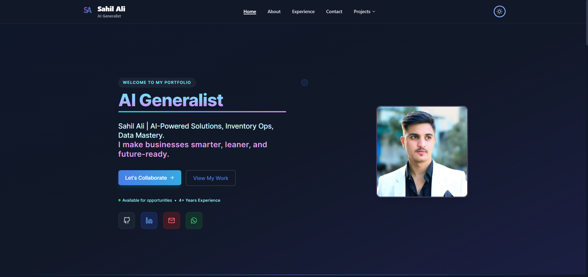
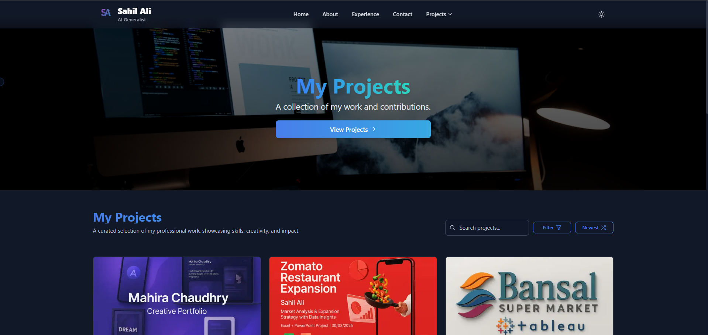
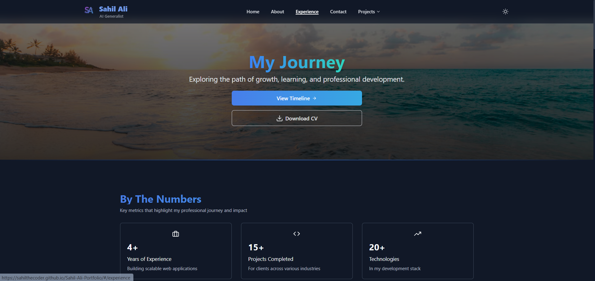
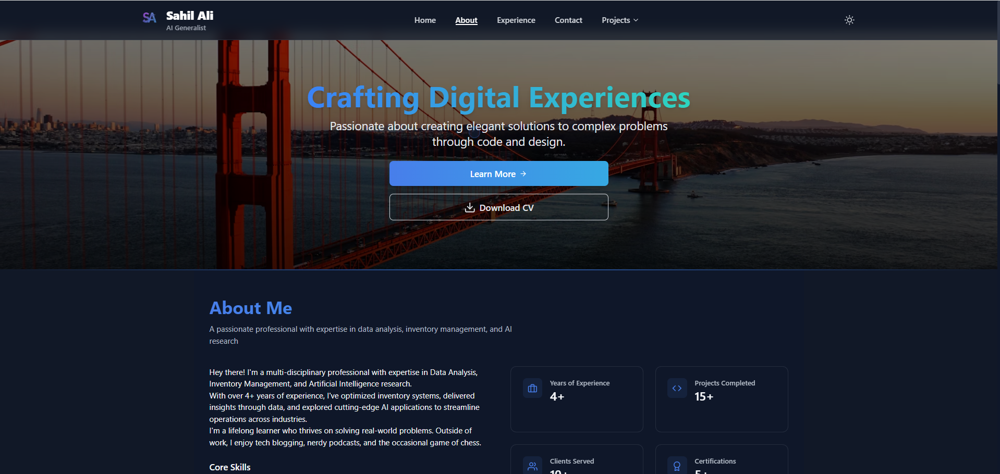
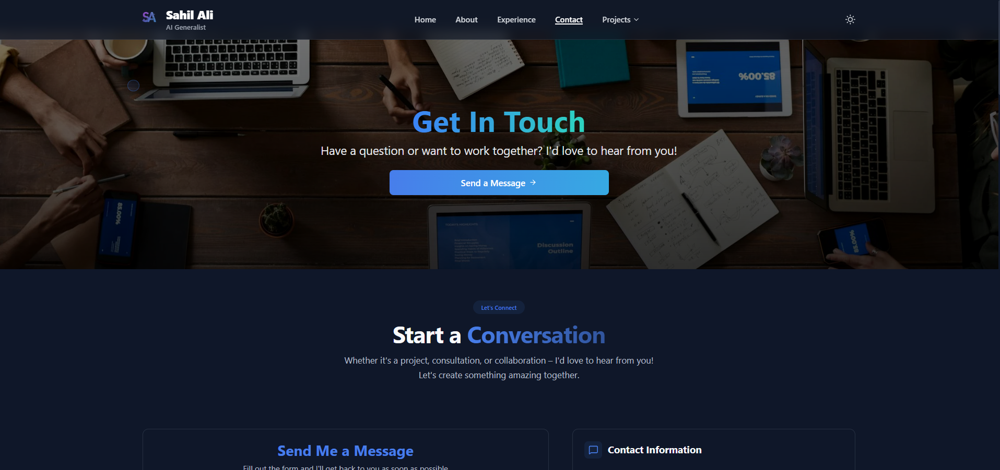

# Sahil Ali - Portfolio

**A modern, responsive portfolio website showcasing my skills, projects, and experience in software development.**

## Description

This is my personal portfolio website built with React 18, TypeScript, and Vite. The website showcases my professional journey, technical skills, projects, and provides a way to get in touch. It features a clean, modern design with smooth animations and a responsive layout that works across all devices.

The project leverages several modern web technologies including React Router for navigation, Framer Motion for animations, Three.js for 3D elements, and Tailwind CSS for styling. It also includes features like dark mode, form validation, and service workers for offline functionality.

## Key Features

- Responsive design with mobile-first approach
- Dark/Light mode theming with `next-themes`
- Smooth animations and transitions with Framer Motion
- Modern React 18 with TypeScript for type safety
- Blazing fast performance with Vite
- Progressive Web App (PWA) ready
- Contact form with EmailJS integration
- SEO optimized with React Helmet Async
- Beautiful UI components with Tailwind CSS
- Client-side routing with React Router v6
- Optimized image loading
- User notifications with React Hot Toast

## Tech Stack

| Technology | Version |
|------------|---------|
| React | 18.3.1 |
| TypeScript | ^5.0.0 |
| Vite | ^5.0.0 |
| Tailwind CSS | ^3.0.0 |
| Framer Motion | ^10.0.0 |
| React Router | ^6.30.1 |
| Three.js | ^0.157.0 |
| GSAP | ^3.12.0 |
| EmailJS | ^4.4.1 |
| React Icons | ^5.5.0 |
| React Hot Toast | ^2.5.2 |
| Zod | ^4.0.16 |
| clsx | ^2.1.1 |
| tailwind-merge | ^2.6.0 |

## Project Structure

```
Sahil-Ali-Portfolio/
├── public/               # Static files
├── src/
│   ├── components/       # Reusable UI components
│   │   ├── ui/           # Shadcn/ui components
│   │   ├── Navigation/   # Navigation components
│   │   └── Skills/       # Skills visualization
│   ├── contexts/         # React contexts
│   ├── data/             # Static data
│   ├── features/         # Feature-based modules
│   │   ├── about/        # About section
│   │   ├── contact/      # Contact form
│   │   ├── experience/   # Work experience
│   │   ├── home/         # Home page
│   │   ├── project/      # Projects showcase
│   │   └── skills/       # Skills section
│   ├── hooks/            # Custom React hooks
│   ├── lib/              # Utility functions
│   ├── pages/            # Page components
│   ├── styles/           # Global styles
│   ├── types/            # TypeScript type definitions
│   ├── utils/            # Helper utilities
│   ├── App.tsx           # Main App component
│   ├── main.tsx          # Application entry point
│   └── vite-env.d.ts     # Vite type definitions
├── .github/              # GitHub workflows
├── scripts/              # Build and utility scripts
├── .eslintrc.json        # ESLint config
├── .gitignore           # Git ignore file
├── package.json         # Project dependencies
├── tailwind.config.ts   # Tailwind CSS config
├── tsconfig.json        # TypeScript config
└── vite.config.ts       # Vite config
```

## Getting Started

### Prerequisites

- Node.js (v18 or higher)
- npm (v9 or higher) or yarn

### Installation

1. Clone the repository:
   ```bash
   git clone https://github.com/SahilTheCoder/Sahil_Ali-Portfolio.git
   cd Sahil_Ali-Portfolio
   ```

2. Install dependencies:
   ```bash
   npm install
   # or
   yarn
   ```

3. Create a `.env` file in the root directory and add your EmailJS service details:
   ```env
   VITE_EMAILJS_SERVICE_ID=your_service_id
   VITE_EMAILJS_TEMPLATE_ID=your_template_id
   VITE_EMAILJS_PUBLIC_KEY=your_public_key
   ```

4. Start the development server:
   ```bash
   npm run dev
   # or
   yarn dev
   ```

5. Open [http://localhost:5173](http://localhost:5173) in your browser.

### Building for Production

```bash
# Build the app for production
npm run build

# Preview the production build
npm run preview
```

## Testing

To run tests:

```bash
# Run tests in watch mode
npm test

# Run tests with coverage
npm test -- --coverage
```

## 📸 Screenshots

<div align="center">
  <h3>Home Page</h3>
  
  
  <h3>Projects</h3>
  
  
  <h3>Experience</h3>
  
  
  <h3>About</h3>
  
  
  <h3>Contact</h3>
  
</div>


## Contributing

Contributions are welcome! Please feel free to submit a Pull Request.

## License

This project is licensed under the MIT License - see the [LICENSE](LICENSE) file for details.

## 👤 Author

**Sahil Ali**  
*Data Analyst | Inventory Specialist | AI Generalist*  
📍 Rajasthan, India

- 🌐 [Portfolio](https://sahilthecoder.github.io/Sahil-Ali-Portfolio/#/)
- 💼 [LinkedIn](https://www.linkedin.com/in/sahil-ali-714867242/)
- 📧 [sahilkhan36985@gmail.com](mailto:sahilkhan36985@gmail.com)
- 📞 +91 9875771550
- 📱 [Instagram](https://www.instagram.com/hey___sahilll/)
- 💻 [GitHub](https://github.com/SahilTheCoder)

🔹 **Availability**: Open to freelance, part-time, and full-time work opportunities  
🔹 **Resume**: [Download CV](/Sahil-Ali-Portfolio/assets/Sahil_Ali_Cv.pdf)
